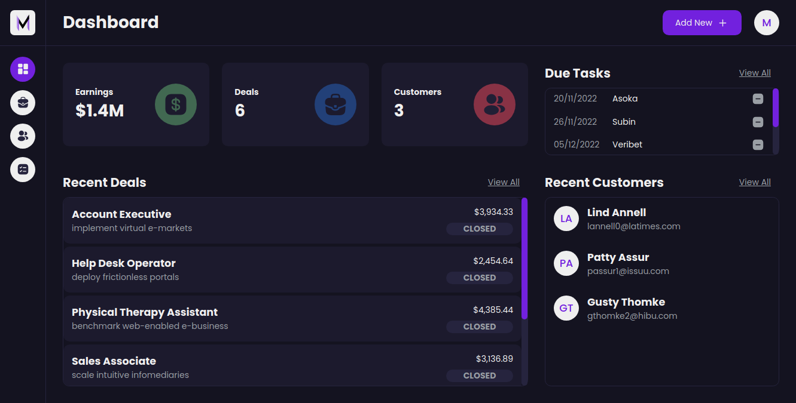

<p align="center">
  <a href="https://m1guelsb.com">
    
  </a>
</p>
<p align="center">
  

  

  

  
</p>

## About 🔎
Customer Relationship Management platform where you can manage customers, earnings, deals and tasks.

---
## Tech Stack 🔧
- Typescript
- Nextjs pages router
- Reactjs 18
- Stitches
- Radix ui
- Tanstack-query
- Tanstack-table
- React-hook-form

---
## How to run 🏃
1. Open `.env.local` change the value to your api url. The current is a json server api used for educational purposes.

2. Run the following in the terminal:
```
npm i
npm run dev
```
